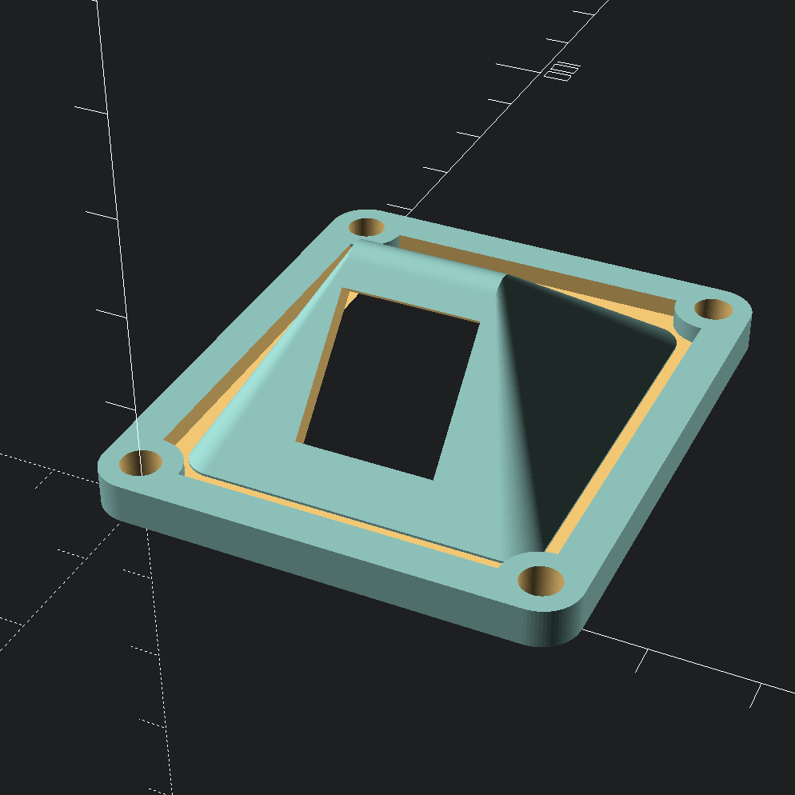

# NEMA17 enclosure cover

This is a additional cover for, and inspired by, [cmooney91's](https://www.thingiverse.com/thing:3214768)
and [geoff_s'](https://www.thingiverse.com/thing:3964641) NEMA17 motor enclosure
designs.

The original cover fits a G12 aviation connector, this one can be used with an
RJ12 socket.

I printed this using black PETG and pressed the connector in place. The
connector fits well on its own, but I used a bit of glue just to be sure.

